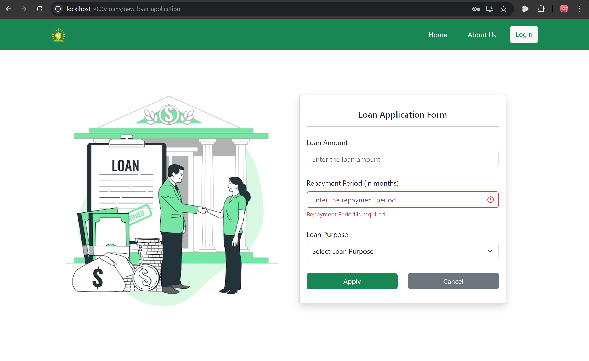
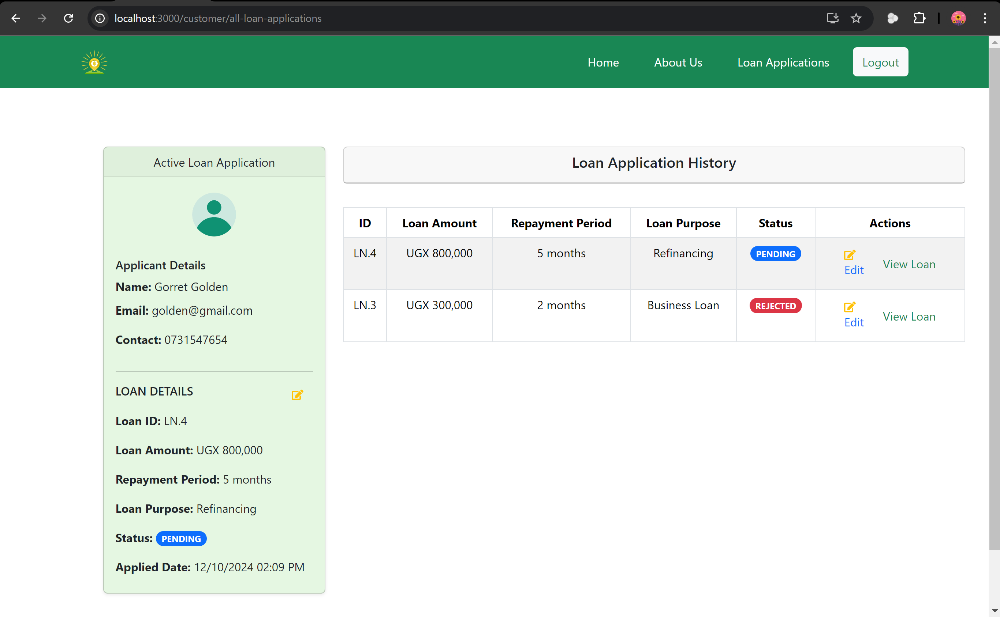
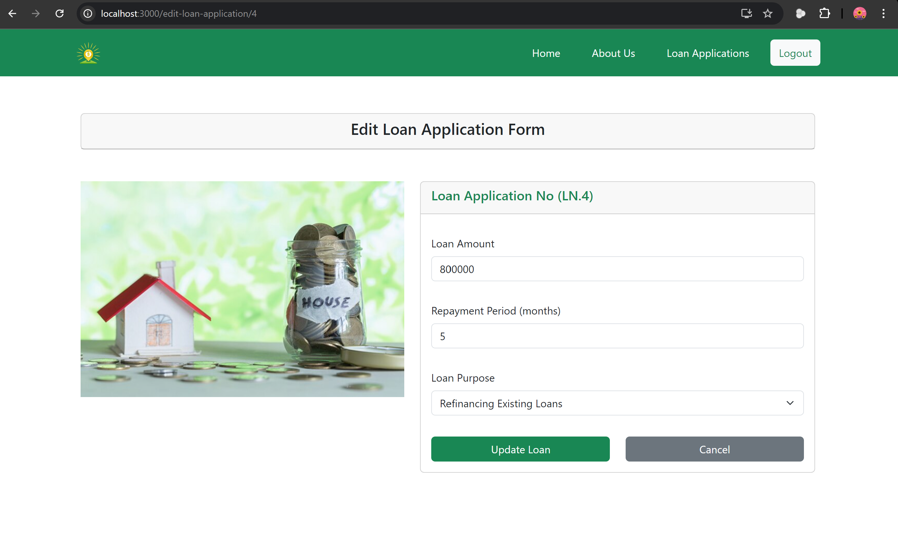
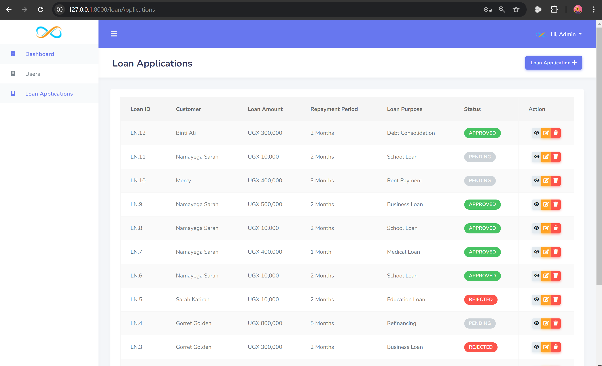
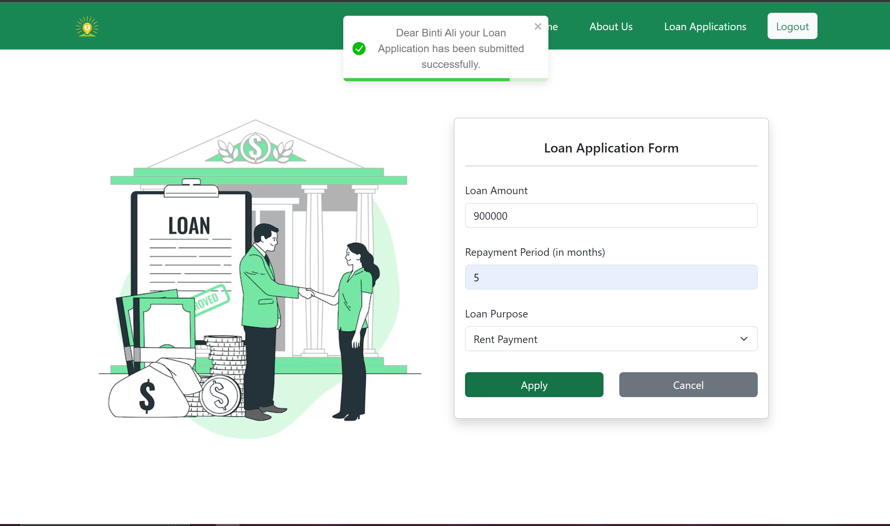
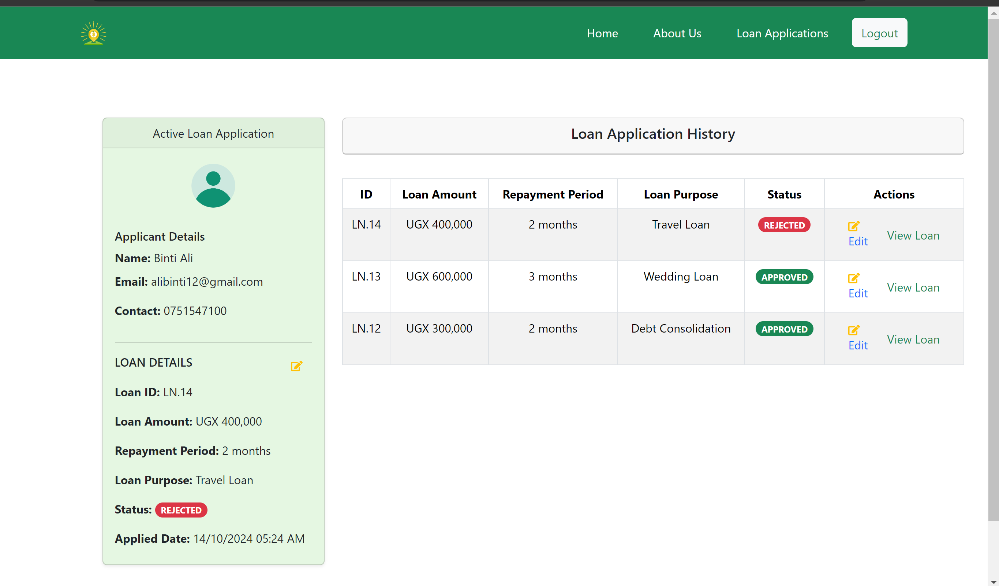
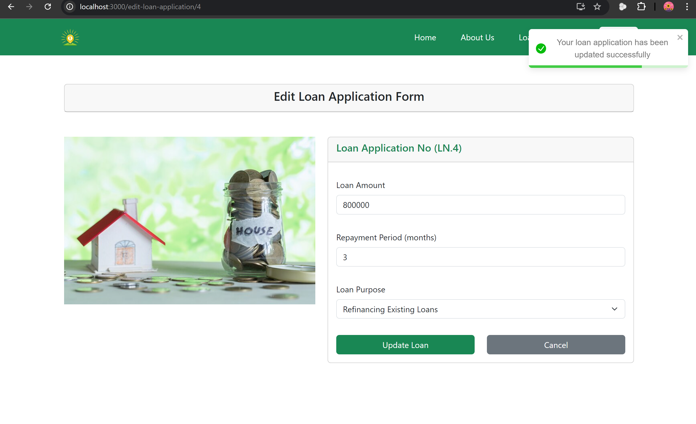
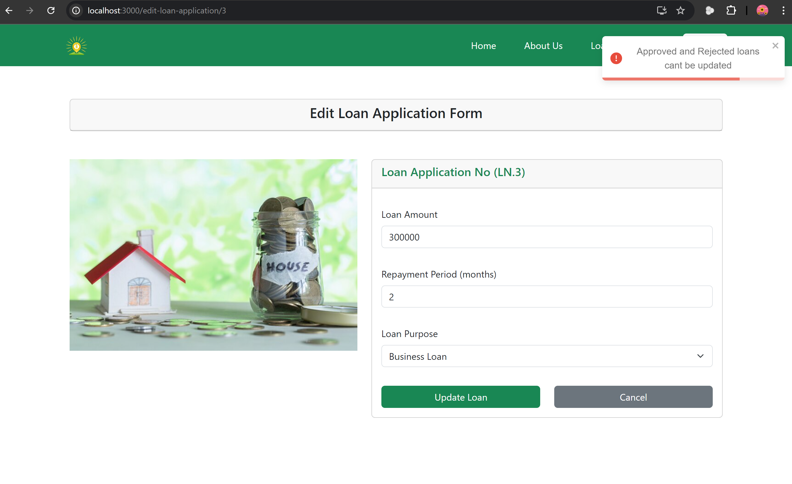
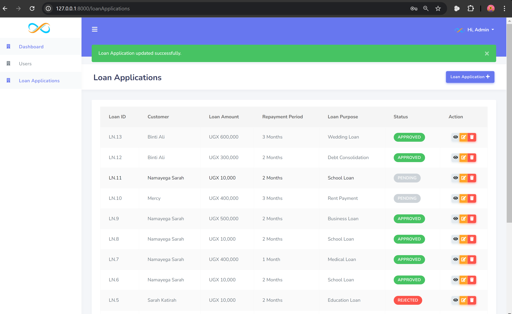

# About Project
This is a take-home assignment on creating a loan application microservice that allows customers to:

- Apply for loans
- View their loan status
- Make updates on their loan application

The project structure includes:

- **Backend**:
  - Built using PHP Laravel
  - Contains an admin dashboard built using Laravel Infyom
  - Provides an API to service the frontend requests

- **Frontend**:
  - Built using React

# Project Setup (Without using Docker)

This README will guide you through setting up the Laravel backend and React frontend for your application.

## Table of Contents

1. [Requirements](#requirements)
2. [Cloning the Project](#cloning-the-project)
3. [Backend Setup](#backend-setup)
4. [Frontend Setup](#frontend-setup)
5. [Project Images](#project-images)
---

## Requirements

Before you begin, ensure you have the following installed on your machine:

- [PHP](https://www.php.net/downloads) (version 7.4 or higher)
- [Composer](https://getcomposer.org/download/)
- [Node.js](https://nodejs.org/en/download/) (version 14 or higher)
- [NPM](https://www.npmjs.com/get-npm) (comes with Node.js)
- [PostgreSQL](https://www.postgresql.org/download/) (make sure the service is running)
- [Docker](https://www.docker.com/products/docker-desktop) (if you choose to use it)

---

## Backend Setup
## Cloning the Project

1. **Clone the Repository**:
   Use the following command to clone the project repository:
   git clone https://github.com/gorretgolden/LoanMicroserviceAssignment

2. **Change Directory**:  
   cd LoanMicroserviceAssignment

3. **Change Directory**:  
   Navigate to the Backend Directory
   cd backend

4. **Install PHP Dependencies**:  
   Install PHP Dependencies: Run the following command to install the Laravel dependencies via Composer
   composer install 
   or composer update then composer install

5. **Environment Configuration**:  
   Copy the example environment file to create a new environment file
   cp .env.example .env
   Open the .env file in a text editor and update the database configuration with your PostgreSQL credentials:
   DB_CONNECTION=pgsql
   DB_HOST=127.0.0.1
   DB_PORT=5432
   DB_DATABASE=your_database_name
   DB_USERNAME=your_username
   DB_PASSWORD=your_password

6. **Generate Application Key**: 
   php artisan key:generate

7. **Run Migrations**: 
   php artisan migrate

8. **Install Node Packages**: 
   npm install 

9. **Compile assets**: 
   npm run dev
  
10. **Start the devlopment server**: 
   php artisan serve
   http://localhost:8000
   

## Frontend Setup

1. **Change Directory (frontend)**:  
   Navigate to the Frontend Directory
   cd ../frontend

2. **Install Node.js Dependencies**:  
   npm install

3. **Change directory to src**:  
   cd src
 
4. **Start the React Development Server**:  
   npm start
   http://localhost:3000  

## Project Images

